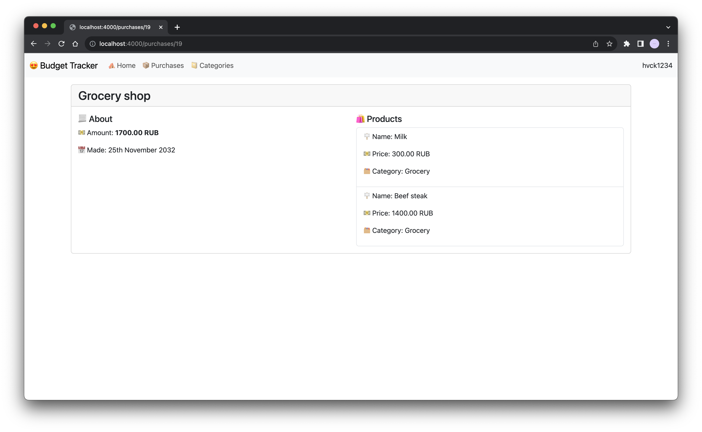

# Budget Tracker UI by hvck 

This is Frontend App for my [budget tracker backend](https://github.com/hvckdev/budget-tracker-backend). This is pretty simple and minimal.




## Requirements
- Node 18 (early versions not tested) or Docker
- [Backend App](https://github.com/hvckdev/budget-tracker-backend)

## Deploy by yourself 
Configure `NUXT_PUBLIC_API_BASE=` in `.env`. Just set base url to [Backend App](https://github.com/hvckdev/budget-tracker-backend).

Then u can:

```bash
npm ci && 
npm run build
```

or

```bash
npm ci && 
npm run dev
```

for development.

Have a nice day. 💖